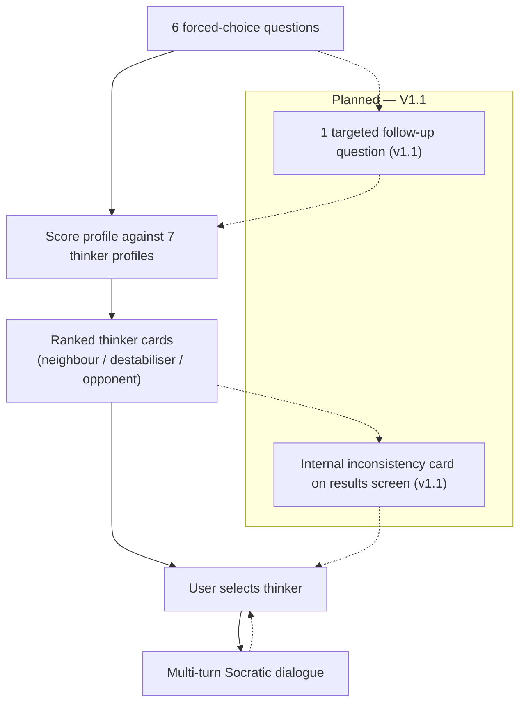
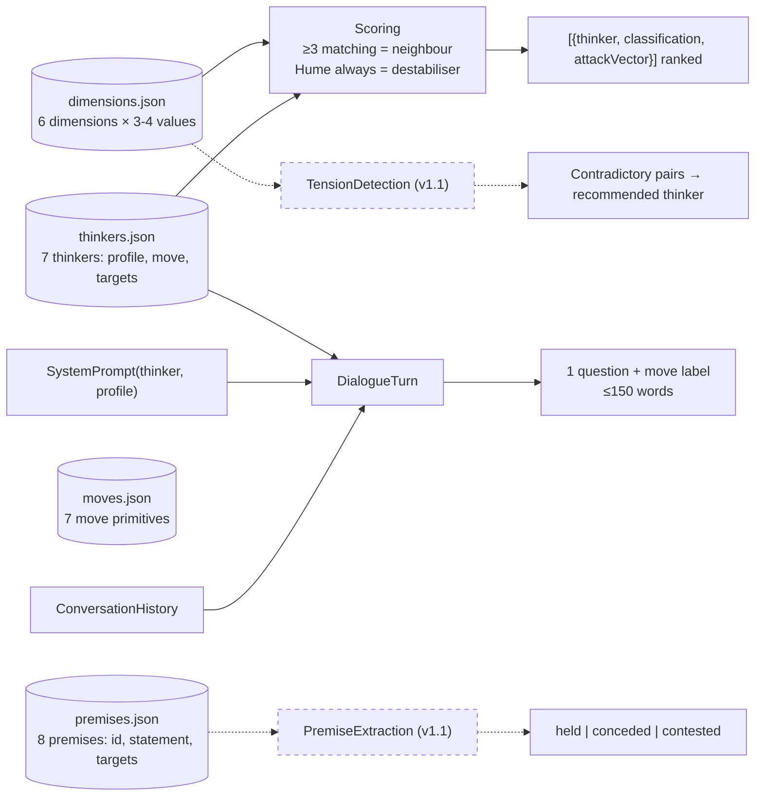
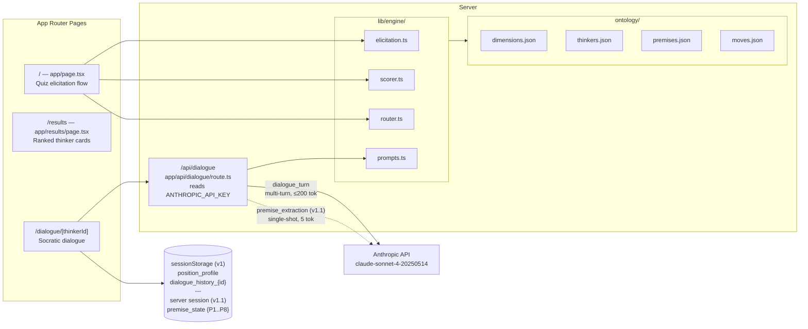

# Architecture Diagrams

_Generated from `docs/architecture.yaml` — do not edit directly. Run `/visual-architecture` to regenerate._

---

## User Journey

---

## Business Logic

---

## System Architecture

